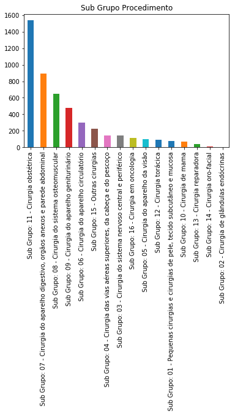

```python
#importar bibliotecas
import pandas as pd
# informar ao matplotlib que os graficos serão inline
%matplotlib inline
```


```python
#importar apenas as colunas necessarias
# 3- Hospital , 6- Municipio , 7-Complexidade,8-carater de atendimento,12-sub grupo de atendimento, 14-procedimento
# usecols=[] -> comando para importar apenas as colunas desejadas
df = pd.read_csv('dataset//cirurgias.csv', sep =';', encoding = 'cp1252', usecols=[3,6,7,8,12,14])

#Trocar o nome das colunas
df.columns =['Hospital','Municipio','Complexidade','Carater Atendimento','Sub Grupo Procedimento','Procedimento']
```


```python
df.head()
```


<div>
<style scoped>
    .dataframe tbody tr th:only-of-type {
        vertical-align: middle;
    }

    .dataframe tbody tr th {
        vertical-align: top;
    }

    .dataframe thead th {
        text-align: right;
    }
</style>
<table border="1" class="dataframe">
  <thead>
    <tr style="text-align: right;">
      <th></th>
      <th>Hospital</th>
      <th>Municipio</th>
      <th>Complexidade</th>
      <th>Carater Atendimento</th>
      <th>Sub Grupo Procedimento</th>
      <th>Procedimento</th>
    </tr>
  </thead>
  <tbody>
    <tr>
      <th>0</th>
      <td>6876617 HOSPITAL DA CRIANCA DE BRASILIA JOSE A...</td>
      <td>BRASILIA, DF, BR</td>
      <td>Média complexidade</td>
      <td>Eletivo</td>
      <td>Sub Grupo: 15 - Outras cirurgias</td>
      <td>TRATAMENTO C/ CIRURGIAS MULTIPLAS</td>
    </tr>
    <tr>
      <th>1</th>
      <td>0010456 HBDF HOSPITAL DE BASE DO DISTRITO FEDERAL</td>
      <td>BRASILIA, DF, BR</td>
      <td>Média complexidade</td>
      <td>Urgência</td>
      <td>Sub Grupo: 03 - Cirurgia do sistema nervoso ce...</td>
      <td>DERIVACAO VENTRICULAR EXTERNAR-SUBGALEAL EXTERNA</td>
    </tr>
    <tr>
      <th>2</th>
      <td>0010456 HBDF HOSPITAL DE BASE DO DISTRITO FEDERAL</td>
      <td>BRASILIA, DF, BR</td>
      <td>Média complexidade</td>
      <td>Urgência</td>
      <td>Sub Grupo: 15 - Outras cirurgias</td>
      <td>TRATAMENTO C/ CIRURGIAS MULTIPLAS</td>
    </tr>
    <tr>
      <th>3</th>
      <td>6876617 HOSPITAL DA CRIANCA DE BRASILIA JOSE A...</td>
      <td>BRASILIA, DF, BR</td>
      <td>Média complexidade</td>
      <td>Eletivo</td>
      <td>Sub Grupo: 07 - Cirurgia do aparelho digestivo...</td>
      <td>HERNIOPLASTIA UMBILICAL</td>
    </tr>
    <tr>
      <th>4</th>
      <td>0010456 HBDF HOSPITAL DE BASE DO DISTRITO FEDERAL</td>
      <td>BRASILIA, DF, BR</td>
      <td>Alta complexidade</td>
      <td>Eletivo</td>
      <td>Sub Grupo: 16 - Cirurgia em oncologia</td>
      <td>RESSECCAO DE TUMOR DE PARTES MOLES EM ONCOLOGIA</td>
    </tr>
  </tbody>
</table>
</div>


```python
#Contando registros
df.count()
```


    Hospital                  4862
    Municipio                 4862
    Complexidade              4862
    Carater Atendimento       4862
    Sub Grupo Procedimento    4862
    Procedimento              4862
    dtype: int64


```python
df['Hospital'].unique()
```


    array(['6876617 HOSPITAL DA CRIANCA DE BRASILIA JOSE ALENCAR HCB',
           '0010456 HBDF HOSPITAL DE BASE DO DISTRITO FEDERAL',
           '0010499 HRT HOSPITAL REGIONAL DE TAGUATINGA', '0010545 HRBZ',
           '0010480 HOSPITAL REGIONAL DE CEILANDIA',
           '3276678 INSTITUTO DE CARDIOLOGIA DO DISTRITO FEDERAL',
           '0010472 HRG', '0010510 HOSPITAL UNIVERSITARIO DE BRASILIA',
           '0010529 HRPL',
           '0010537 HOSPITAL MATERNO INFANTIL DE BRASILIA HMIB',
           '3055450 CBV CENTRO BRASILEIRO DA VISAO',
           '2672197 HRSAM HOSPITAL REGIONAL DE SAMAMBAIA', '0010502 HRS',
           '5717515 HRSM', '2645157 HRPA', '0010464 HRAN'], dtype=object)


```python
df.describe()
```


<div>
<style scoped>
    .dataframe tbody tr th:only-of-type {
        vertical-align: middle;
    }

    .dataframe tbody tr th {
        vertical-align: top;
    }

    .dataframe thead th {
        text-align: right;
    }
</style>
<table border="1" class="dataframe">
  <thead>
    <tr style="text-align: right;">
      <th></th>
      <th>Hospital</th>
      <th>Municipio</th>
      <th>Complexidade</th>
      <th>Carater Atendimento</th>
      <th>Sub Grupo Procedimento</th>
      <th>Procedimento</th>
    </tr>
  </thead>
  <tbody>
    <tr>
      <th>count</th>
      <td>4862</td>
      <td>4862</td>
      <td>4862</td>
      <td>4862</td>
      <td>4862</td>
      <td>4862</td>
    </tr>
    <tr>
      <th>unique</th>
      <td>16</td>
      <td>11</td>
      <td>2</td>
      <td>4</td>
      <td>16</td>
      <td>495</td>
    </tr>
    <tr>
      <th>top</th>
      <td>0010456 HBDF HOSPITAL DE BASE DO DISTRITO FEDERAL</td>
      <td>BRASILIA, DF, BR</td>
      <td>Média complexidade</td>
      <td>Urgência</td>
      <td>Sub Grupo: 11 - Cirurgia obstétrica</td>
      <td>PARTO CESARIANO</td>
    </tr>
    <tr>
      <th>freq</th>
      <td>735</td>
      <td>1923</td>
      <td>4353</td>
      <td>3794</td>
      <td>1539</td>
      <td>1060</td>
    </tr>
  </tbody>
</table>
</div>


```python
#Quantas cirurgias foram realizadas em cada hospital
df['Hospital'].value_counts()
```


    0010456 HBDF HOSPITAL DE BASE DO DISTRITO FEDERAL           735
    0010472 HRG                                                 555
    0010480 HOSPITAL REGIONAL DE CEILANDIA                      461
    0010464 HRAN                                                432
    0010499 HRT HOSPITAL REGIONAL DE TAGUATINGA                 373
    0010510 HOSPITAL UNIVERSITARIO DE BRASILIA                  350
    2645157 HRPA                                                327
    0010537 HOSPITAL MATERNO INFANTIL DE BRASILIA HMIB          298
    5717515 HRSM                                                281
    0010529 HRPL                                                256
    0010502 HRS                                                 225
    2672197 HRSAM HOSPITAL REGIONAL DE SAMAMBAIA                195
    3276678 INSTITUTO DE CARDIOLOGIA DO DISTRITO FEDERAL        191
    0010545 HRBZ                                                 75
    6876617 HOSPITAL DA CRIANCA DE BRASILIA JOSE ALENCAR HCB     74
    3055450 CBV CENTRO BRASILEIRO DA VISAO                       34
    Name: Hospital, dtype: int64


```python
#Quantas cirurgias por sub grupo procedimento
df['Sub Grupo Procedimento'].value_counts()
```


    Sub Grupo: 11 - Cirurgia obstétrica                                                   1539
    Sub Grupo: 07 - Cirurgia do aparelho digestivo, orgãos anexos e parede abdominal       893
    Sub Grupo: 08 - Cirurgia do sistema osteomuscular                                      651
    Sub Grupo: 09 - Cirurgia do aparelho geniturinário                                     474
    Sub Grupo: 06 - Cirurgia do aparelho circulatório                                      299
    Sub Grupo: 15 - Outras cirurgias                                                       223
    Sub Grupo: 04 - Cirurgia das vias aéreas superiores, da cabeça e do pescoço            145
    Sub Grupo: 03 - Cirurgia do sistema nervoso central e periférico                       141
    Sub Grupo: 16 - Cirurgia em oncologia                                                  110
    Sub Grupo: 05 - Cirurgia do aparelho da visão                                           98
    Sub Grupo: 12 - Cirurgia torácica                                                       92
    Sub Grupo: 01 - Pequenas cirurgias e cirurgias de pele, tecido subcutâneo e mucosa      77
    Sub Grupo: 10 - Cirurgia de mama                                                        68
    Sub Grupo: 13 - Cirurgia reparadora                                                     40
    Sub Grupo: 14 - Cirurgia oro-facial                                                      7
    Sub Grupo: 02 - Cirurgia de glândulas endócrinas                                         5
    Name: Sub Grupo Procedimento, dtype: int64


```python
# plotar o grafico por sub grupo procedimento
df['Sub Grupo Procedimento'].value_counts().plot.bar(title='Sub Grupo Procedimento')
```


    <matplotlib.axes._subplots.AxesSubplot at 0x239f6d49d68>





```python
#criar um subconjunto dos dados originais
df_hospbase = df[df['Hospital'] == '0010456 HBDF HOSPITAL DE BASE DO DISTRITO FEDERAL']
```


```python
#resetar o indice
df_hospbase.reset_index()
```


<div>
<style scoped>
    .dataframe tbody tr th:only-of-type {
        vertical-align: middle;
    }

    .dataframe tbody tr th {
        vertical-align: top;
    }

    .dataframe thead th {
        text-align: right;
    }
</style>
<table border="1" class="dataframe">
  <thead>
    <tr style="text-align: right;">
      <th></th>
      <th>index</th>
      <th>Hospital</th>
      <th>Municipio</th>
      <th>Complexidade</th>
      <th>Carater Atendimento</th>
      <th>Sub Grupo Procedimento</th>
      <th>Procedimento</th>
    </tr>
  </thead>
  <tbody>
    <tr>
      <th>0</th>
      <td>1</td>
      <td>0010456 HBDF HOSPITAL DE BASE DO DISTRITO FEDERAL</td>
      <td>BRASILIA, DF, BR</td>
      <td>Média complexidade</td>
      <td>Urgência</td>
      <td>Sub Grupo: 03 - Cirurgia do sistema nervoso ce...</td>
      <td>DERIVACAO VENTRICULAR EXTERNAR-SUBGALEAL EXTERNA</td>
    </tr>
    <tr>
      <th>1</th>
      <td>2</td>
      <td>0010456 HBDF HOSPITAL DE BASE DO DISTRITO FEDERAL</td>
      <td>BRASILIA, DF, BR</td>
      <td>Média complexidade</td>
      <td>Urgência</td>
      <td>Sub Grupo: 15 - Outras cirurgias</td>
      <td>TRATAMENTO C/ CIRURGIAS MULTIPLAS</td>
    </tr>
    <tr>
      <th>2</th>
      <td>4</td>
      <td>0010456 HBDF HOSPITAL DE BASE DO DISTRITO FEDERAL</td>
      <td>BRASILIA, DF, BR</td>
      <td>Alta complexidade</td>
      <td>Eletivo</td>
      <td>Sub Grupo: 16 - Cirurgia em oncologia</td>
      <td>RESSECCAO DE TUMOR DE PARTES MOLES EM ONCOLOGIA</td>
    </tr>
    <tr>
      <th>3</th>
      <td>5</td>
      <td>0010456 HBDF HOSPITAL DE BASE DO DISTRITO FEDERAL</td>
      <td>BRASILIA, DF, BR</td>
      <td>Alta complexidade</td>
      <td>Eletivo</td>
      <td>Sub Grupo: 06 - Cirurgia do aparelho circulatório</td>
      <td>IMPLANTAÇÃO DE CATETER DE LONGA PERMANÊNCIA SE...</td>
    </tr>
    <tr>
      <th>4</th>
      <td>6</td>
      <td>0010456 HBDF HOSPITAL DE BASE DO DISTRITO FEDERAL</td>
      <td>BRASILIA, DF, BR</td>
      <td>Média complexidade</td>
      <td>Urgência</td>
      <td>Sub Grupo: 06 - Cirurgia do aparelho circulatório</td>
      <td>TRATAMENTO CIRURGICO DE LESOES VASCULARES TRAU...</td>
    </tr>
    <tr>
      <th>5</th>
      <td>7</td>
      <td>0010456 HBDF HOSPITAL DE BASE DO DISTRITO FEDERAL</td>
      <td>BRASILIA, DF, BR</td>
      <td>Média complexidade</td>
      <td>Eletivo</td>
      <td>Sub Grupo: 04 - Cirurgia das vias aéreas super...</td>
      <td>SEPTOPLASTIA  PARA CORREÇÃO DE DESVIO</td>
    </tr>
    <tr>
      <th>6</th>
      <td>8</td>
      <td>0010456 HBDF HOSPITAL DE BASE DO DISTRITO FEDERAL</td>
      <td>BRASILIA, DF, BR</td>
      <td>Média complexidade</td>
      <td>Eletivo</td>
      <td>Sub Grupo: 07 - Cirurgia do aparelho digestivo...</td>
      <td>COLECISTECTOMIA VIDEOLAPAROSCOPICA</td>
    </tr>
    <tr>
      <th>7</th>
      <td>9</td>
      <td>0010456 HBDF HOSPITAL DE BASE DO DISTRITO FEDERAL</td>
      <td>BRASILIA, DF, BR</td>
      <td>Alta complexidade</td>
      <td>Urgência</td>
      <td>Sub Grupo: 06 - Cirurgia do aparelho circulatório</td>
      <td>ANGIOPLASTIA CORONARIANA C/ IMPLANTE DE DOIS S...</td>
    </tr>
    <tr>
      <th>8</th>
      <td>10</td>
      <td>0010456 HBDF HOSPITAL DE BASE DO DISTRITO FEDERAL</td>
      <td>BRASILIA, DF, BR</td>
      <td>Média complexidade</td>
      <td>Urgência</td>
      <td>Sub Grupo: 08 - Cirurgia do sistema osteomuscular</td>
      <td>AMPUTACAO / DESARTICULACAO DE MEMBROS INFERIORES</td>
    </tr>
    <tr>
      <th>9</th>
      <td>11</td>
      <td>0010456 HBDF HOSPITAL DE BASE DO DISTRITO FEDERAL</td>
      <td>BRASILIA, DF, BR</td>
      <td>Alta complexidade</td>
      <td>Eletivo</td>
      <td>Sub Grupo: 16 - Cirurgia em oncologia</td>
      <td>SEGMENTECTOMIA/QUADRANTECTOMIA/SETORECTOMIA DE...</td>
    </tr>
    <tr>
      <th>10</th>
      <td>12</td>
      <td>0010456 HBDF HOSPITAL DE BASE DO DISTRITO FEDERAL</td>
      <td>BRASILIA, DF, BR</td>
      <td>Média complexidade</td>
      <td>Outros tipos lesões/envenenamentos por agentes...</td>
      <td>Sub Grupo: 15 - Outras cirurgias</td>
      <td>TRATAMENTO C/ CIRURGIAS MULTIPLAS</td>
    </tr>
    <tr>
      <th>11</th>
      <td>13</td>
      <td>0010456 HBDF HOSPITAL DE BASE DO DISTRITO FEDERAL</td>
      <td>BRASILIA, DF, BR</td>
      <td>Média complexidade</td>
      <td>Eletivo</td>
      <td>Sub Grupo: 07 - Cirurgia do aparelho digestivo...</td>
      <td>COLECTOMIA PARCIAL (HEMICOLECTOMIA)</td>
    </tr>
    <tr>
      <th>12</th>
      <td>14</td>
      <td>0010456 HBDF HOSPITAL DE BASE DO DISTRITO FEDERAL</td>
      <td>BRASILIA, DF, BR</td>
      <td>Alta complexidade</td>
      <td>Urgência</td>
      <td>Sub Grupo: 06 - Cirurgia do aparelho circulatório</td>
      <td>ANGIOPLASTIA CORONARIANA C/ IMPLANTE DE DOIS S...</td>
    </tr>
    <tr>
      <th>13</th>
      <td>15</td>
      <td>0010456 HBDF HOSPITAL DE BASE DO DISTRITO FEDERAL</td>
      <td>BRASILIA, DF, BR</td>
      <td>Alta complexidade</td>
      <td>Eletivo</td>
      <td>Sub Grupo: 12 - Cirurgia torácica</td>
      <td>METASTASECTOMIA PULMONAR UNI OU BILATERAL (QUA...</td>
    </tr>
    <tr>
      <th>14</th>
      <td>16</td>
      <td>0010456 HBDF HOSPITAL DE BASE DO DISTRITO FEDERAL</td>
      <td>BRASILIA, DF, BR</td>
      <td>Média complexidade</td>
      <td>Urgência</td>
      <td>Sub Grupo: 04 - Cirurgia das vias aéreas super...</td>
      <td>TRAQUEOSTOMIA</td>
    </tr>
    <tr>
      <th>15</th>
      <td>17</td>
      <td>0010456 HBDF HOSPITAL DE BASE DO DISTRITO FEDERAL</td>
      <td>BRASILIA, DF, BR</td>
      <td>Média complexidade</td>
      <td>Outros tipos lesões/envenenamentos por agentes...</td>
      <td>Sub Grupo: 03 - Cirurgia do sistema nervoso ce...</td>
      <td>TRATAMENTO CIRURGICO DE HEMATOMA SUBDURAL AGUDO</td>
    </tr>
    <tr>
      <th>16</th>
      <td>20</td>
      <td>0010456 HBDF HOSPITAL DE BASE DO DISTRITO FEDERAL</td>
      <td>BRASILIA, DF, BR</td>
      <td>Média complexidade</td>
      <td>Urgência</td>
      <td>Sub Grupo: 04 - Cirurgia das vias aéreas super...</td>
      <td>TRAQUEOSTOMIA</td>
    </tr>
    <tr>
      <th>17</th>
      <td>21</td>
      <td>0010456 HBDF HOSPITAL DE BASE DO DISTRITO FEDERAL</td>
      <td>BRASILIA, DF, BR</td>
      <td>Média complexidade</td>
      <td>Eletivo</td>
      <td>Sub Grupo: 15 - Outras cirurgias</td>
      <td>TRATAMENTO C/ CIRURGIAS MULTIPLAS</td>
    </tr>
    <tr>
      <th>18</th>
      <td>22</td>
      <td>0010456 HBDF HOSPITAL DE BASE DO DISTRITO FEDERAL</td>
      <td>BRASILIA, DF, BR</td>
      <td>Média complexidade</td>
      <td>Outros tipos lesões/envenenamentos por agentes...</td>
      <td>Sub Grupo: 04 - Cirurgia das vias aéreas super...</td>
      <td>RETIRADA DE CORPO ESTRANHO DE OUVIDO / FARINGE...</td>
    </tr>
    <tr>
      <th>19</th>
      <td>23</td>
      <td>0010456 HBDF HOSPITAL DE BASE DO DISTRITO FEDERAL</td>
      <td>BRASILIA, DF, BR</td>
      <td>Média complexidade</td>
      <td>Eletivo</td>
      <td>Sub Grupo: 07 - Cirurgia do aparelho digestivo...</td>
      <td>LAPAROTOMIA EXPLORADORA</td>
    </tr>
    <tr>
      <th>20</th>
      <td>24</td>
      <td>0010456 HBDF HOSPITAL DE BASE DO DISTRITO FEDERAL</td>
      <td>BRASILIA, DF, BR</td>
      <td>Média complexidade</td>
      <td>Eletivo</td>
      <td>Sub Grupo: 07 - Cirurgia do aparelho digestivo...</td>
      <td>ESOFAGOPLASTIA / GASTROPLASTIA</td>
    </tr>
    <tr>
      <th>21</th>
      <td>25</td>
      <td>0010456 HBDF HOSPITAL DE BASE DO DISTRITO FEDERAL</td>
      <td>BRASILIA, DF, BR</td>
      <td>Alta complexidade</td>
      <td>Eletivo</td>
      <td>Sub Grupo: 06 - Cirurgia do aparelho circulatório</td>
      <td>TROCA DE GERADOR DE MARCAPASSO DE CAMARA DUPLA</td>
    </tr>
    <tr>
      <th>22</th>
      <td>26</td>
      <td>0010456 HBDF HOSPITAL DE BASE DO DISTRITO FEDERAL</td>
      <td>BRASILIA, DF, BR</td>
      <td>Média complexidade</td>
      <td>Eletivo</td>
      <td>Sub Grupo: 09 - Cirurgia do aparelho geniturin...</td>
      <td>HISTERECTOMIA C/ ANEXECTOMIA (UNI / BILATERAL)</td>
    </tr>
    <tr>
      <th>23</th>
      <td>27</td>
      <td>0010456 HBDF HOSPITAL DE BASE DO DISTRITO FEDERAL</td>
      <td>BRASILIA, DF, BR</td>
      <td>Média complexidade</td>
      <td>Urgência</td>
      <td>Sub Grupo: 03 - Cirurgia do sistema nervoso ce...</td>
      <td>TRATAMENTO CIRURGICO DE HEMATOMA EXTRADURAL</td>
    </tr>
    <tr>
      <th>24</th>
      <td>28</td>
      <td>0010456 HBDF HOSPITAL DE BASE DO DISTRITO FEDERAL</td>
      <td>BRASILIA, DF, BR</td>
      <td>Média complexidade</td>
      <td>Urgência</td>
      <td>Sub Grupo: 03 - Cirurgia do sistema nervoso ce...</td>
      <td>DERIVACAO VENTRICULAR PARA PERITONEO / ATRIO /...</td>
    </tr>
    <tr>
      <th>25</th>
      <td>29</td>
      <td>0010456 HBDF HOSPITAL DE BASE DO DISTRITO FEDERAL</td>
      <td>BRASILIA, DF, BR</td>
      <td>Média complexidade</td>
      <td>Urgência</td>
      <td>Sub Grupo: 04 - Cirurgia das vias aéreas super...</td>
      <td>SEPTOPLASTIA  PARA CORREÇÃO DE DESVIO</td>
    </tr>
    <tr>
      <th>26</th>
      <td>30</td>
      <td>0010456 HBDF HOSPITAL DE BASE DO DISTRITO FEDERAL</td>
      <td>BRASILIA, DF, BR</td>
      <td>Média complexidade</td>
      <td>Urgência</td>
      <td>Sub Grupo: 04 - Cirurgia das vias aéreas super...</td>
      <td>TRAQUEOSTOMIA</td>
    </tr>
    <tr>
      <th>27</th>
      <td>31</td>
      <td>0010456 HBDF HOSPITAL DE BASE DO DISTRITO FEDERAL</td>
      <td>BRASILIA, DF, BR</td>
      <td>Média complexidade</td>
      <td>Urgência</td>
      <td>Sub Grupo: 03 - Cirurgia do sistema nervoso ce...</td>
      <td>TRATAMENTO CIRURGICO DE HEMATOMA EXTRADURAL</td>
    </tr>
    <tr>
      <th>28</th>
      <td>33</td>
      <td>0010456 HBDF HOSPITAL DE BASE DO DISTRITO FEDERAL</td>
      <td>BRASILIA, DF, BR</td>
      <td>Média complexidade</td>
      <td>Urgência</td>
      <td>Sub Grupo: 03 - Cirurgia do sistema nervoso ce...</td>
      <td>DERIVACAO VENTRICULAR PARA PERITONEO / ATRIO /...</td>
    </tr>
    <tr>
      <th>29</th>
      <td>34</td>
      <td>0010456 HBDF HOSPITAL DE BASE DO DISTRITO FEDERAL</td>
      <td>BRASILIA, DF, BR</td>
      <td>Média complexidade</td>
      <td>Urgência</td>
      <td>Sub Grupo: 08 - Cirurgia do sistema osteomuscular</td>
      <td>REDUÇÃO INCRUENTA DE FRATURA DIAFISARIA DOS OS...</td>
    </tr>
    <tr>
      <th>...</th>
      <td>...</td>
      <td>...</td>
      <td>...</td>
      <td>...</td>
      <td>...</td>
      <td>...</td>
      <td>...</td>
    </tr>
    <tr>
      <th>705</th>
      <td>2338</td>
      <td>0010456 HBDF HOSPITAL DE BASE DO DISTRITO FEDERAL</td>
      <td>BRASILIA, DF, BR</td>
      <td>Média complexidade</td>
      <td>Eletivo</td>
      <td>Sub Grupo: 04 - Cirurgia das vias aéreas super...</td>
      <td>TIMPANOPLASTIA (UNI / BILATERAL)</td>
    </tr>
    <tr>
      <th>706</th>
      <td>2339</td>
      <td>0010456 HBDF HOSPITAL DE BASE DO DISTRITO FEDERAL</td>
      <td>BRASILIA, DF, BR</td>
      <td>Alta complexidade</td>
      <td>Eletivo</td>
      <td>Sub Grupo: 16 - Cirurgia em oncologia</td>
      <td>TIREOIDECTOMIA TOTAL EM ONCOLOGIA</td>
    </tr>
    <tr>
      <th>707</th>
      <td>2340</td>
      <td>0010456 HBDF HOSPITAL DE BASE DO DISTRITO FEDERAL</td>
      <td>BRASILIA, DF, BR</td>
      <td>Média complexidade</td>
      <td>Eletivo</td>
      <td>Sub Grupo: 06 - Cirurgia do aparelho circulatório</td>
      <td>EMBOLECTOMIA ARTERIAL</td>
    </tr>
    <tr>
      <th>708</th>
      <td>2341</td>
      <td>0010456 HBDF HOSPITAL DE BASE DO DISTRITO FEDERAL</td>
      <td>BRASILIA, DF, BR</td>
      <td>Média complexidade</td>
      <td>Eletivo</td>
      <td>Sub Grupo: 05 - Cirurgia do aparelho da visão</td>
      <td>EVISCERACAO DE GLOBO OCULAR</td>
    </tr>
    <tr>
      <th>709</th>
      <td>2342</td>
      <td>0010456 HBDF HOSPITAL DE BASE DO DISTRITO FEDERAL</td>
      <td>BRASILIA, DF, BR</td>
      <td>Média complexidade</td>
      <td>Eletivo</td>
      <td>Sub Grupo: 04 - Cirurgia das vias aéreas super...</td>
      <td>TRAQUEOSTOMIA</td>
    </tr>
    <tr>
      <th>710</th>
      <td>2343</td>
      <td>0010456 HBDF HOSPITAL DE BASE DO DISTRITO FEDERAL</td>
      <td>BRASILIA, DF, BR</td>
      <td>Média complexidade</td>
      <td>Outros tipo de acidente de trânsito</td>
      <td>Sub Grupo: 04 - Cirurgia das vias aéreas super...</td>
      <td>OSTEOSSÍNTESE DE FRATURA SIMPLES DE MANDÍBULA</td>
    </tr>
    <tr>
      <th>711</th>
      <td>2344</td>
      <td>0010456 HBDF HOSPITAL DE BASE DO DISTRITO FEDERAL</td>
      <td>BRASILIA, DF, BR</td>
      <td>Média complexidade</td>
      <td>Outros tipos lesões/envenenamentos por agentes...</td>
      <td>Sub Grupo: 08 - Cirurgia do sistema osteomuscular</td>
      <td>TRATAMENTO CIRÚRGICO DE FRATURA LESÃO FISÁRIA ...</td>
    </tr>
    <tr>
      <th>712</th>
      <td>2345</td>
      <td>0010456 HBDF HOSPITAL DE BASE DO DISTRITO FEDERAL</td>
      <td>BRASILIA, DF, BR</td>
      <td>Média complexidade</td>
      <td>Outros tipos lesões/envenenamentos por agentes...</td>
      <td>Sub Grupo: 08 - Cirurgia do sistema osteomuscular</td>
      <td>TRATAMENTO CIRÚRGICO DE FRATURA DIAFISARIA DE ...</td>
    </tr>
    <tr>
      <th>713</th>
      <td>2346</td>
      <td>0010456 HBDF HOSPITAL DE BASE DO DISTRITO FEDERAL</td>
      <td>BRASILIA, DF, BR</td>
      <td>Média complexidade</td>
      <td>Outros tipo de acidente de trânsito</td>
      <td>Sub Grupo: 08 - Cirurgia do sistema osteomuscular</td>
      <td>TRATAMENTO CIRÚRGICO DE FRATURA TRANSTROCANTER...</td>
    </tr>
    <tr>
      <th>714</th>
      <td>2347</td>
      <td>0010456 HBDF HOSPITAL DE BASE DO DISTRITO FEDERAL</td>
      <td>BRASILIA, DF, BR</td>
      <td>Média complexidade</td>
      <td>Eletivo</td>
      <td>Sub Grupo: 03 - Cirurgia do sistema nervoso ce...</td>
      <td>TRATAMENTO CIRURGICO DE HEMATOMA SUBDURAL CRONICO</td>
    </tr>
    <tr>
      <th>715</th>
      <td>2348</td>
      <td>0010456 HBDF HOSPITAL DE BASE DO DISTRITO FEDERAL</td>
      <td>BRASILIA, DF, BR</td>
      <td>Média complexidade</td>
      <td>Eletivo</td>
      <td>Sub Grupo: 15 - Outras cirurgias</td>
      <td>TRATAMENTO C/ CIRURGIAS MULTIPLAS</td>
    </tr>
    <tr>
      <th>716</th>
      <td>2349</td>
      <td>0010456 HBDF HOSPITAL DE BASE DO DISTRITO FEDERAL</td>
      <td>BRASILIA, DF, BR</td>
      <td>Alta complexidade</td>
      <td>Eletivo</td>
      <td>Sub Grupo: 06 - Cirurgia do aparelho circulatório</td>
      <td>TROCA DE GERADOR DE MARCAPASSO DE CAMARA DUPLA</td>
    </tr>
    <tr>
      <th>717</th>
      <td>2351</td>
      <td>0010456 HBDF HOSPITAL DE BASE DO DISTRITO FEDERAL</td>
      <td>BRASILIA, DF, BR</td>
      <td>Média complexidade</td>
      <td>Urgência</td>
      <td>Sub Grupo: 06 - Cirurgia do aparelho circulatório</td>
      <td>IMPLANTE DE MARCAPASSO TEMPORARIO TRANSVENOSO</td>
    </tr>
    <tr>
      <th>718</th>
      <td>2352</td>
      <td>0010456 HBDF HOSPITAL DE BASE DO DISTRITO FEDERAL</td>
      <td>BRASILIA, DF, BR</td>
      <td>Média complexidade</td>
      <td>Eletivo</td>
      <td>Sub Grupo: 04 - Cirurgia das vias aéreas super...</td>
      <td>TRAQUEOSTOMIA</td>
    </tr>
    <tr>
      <th>719</th>
      <td>2353</td>
      <td>0010456 HBDF HOSPITAL DE BASE DO DISTRITO FEDERAL</td>
      <td>BRASILIA, DF, BR</td>
      <td>Média complexidade</td>
      <td>Urgência</td>
      <td>Sub Grupo: 04 - Cirurgia das vias aéreas super...</td>
      <td>DRENAGEM DE ABSCESSO PERIAMIGDALIANO</td>
    </tr>
    <tr>
      <th>720</th>
      <td>2354</td>
      <td>0010456 HBDF HOSPITAL DE BASE DO DISTRITO FEDERAL</td>
      <td>BRASILIA, DF, BR</td>
      <td>Média complexidade</td>
      <td>Urgência</td>
      <td>Sub Grupo: 15 - Outras cirurgias</td>
      <td>TRATAMENTO C/ CIRURGIAS MULTIPLAS</td>
    </tr>
    <tr>
      <th>721</th>
      <td>2355</td>
      <td>0010456 HBDF HOSPITAL DE BASE DO DISTRITO FEDERAL</td>
      <td>BRASILIA, DF, BR</td>
      <td>Média complexidade</td>
      <td>Eletivo</td>
      <td>Sub Grupo: 09 - Cirurgia do aparelho geniturin...</td>
      <td>URETEROLITOTOMIA</td>
    </tr>
    <tr>
      <th>722</th>
      <td>2356</td>
      <td>0010456 HBDF HOSPITAL DE BASE DO DISTRITO FEDERAL</td>
      <td>BRASILIA, DF, BR</td>
      <td>Média complexidade</td>
      <td>Urgência</td>
      <td>Sub Grupo: 15 - Outras cirurgias</td>
      <td>TRATAMENTO C/ CIRURGIAS MULTIPLAS</td>
    </tr>
    <tr>
      <th>723</th>
      <td>2358</td>
      <td>0010456 HBDF HOSPITAL DE BASE DO DISTRITO FEDERAL</td>
      <td>BRASILIA, DF, BR</td>
      <td>Média complexidade</td>
      <td>Urgência</td>
      <td>Sub Grupo: 04 - Cirurgia das vias aéreas super...</td>
      <td>OSTEOSSÍNTESE DA FRATURA COMPLEXA DA MANDÍBULA</td>
    </tr>
    <tr>
      <th>724</th>
      <td>2362</td>
      <td>0010456 HBDF HOSPITAL DE BASE DO DISTRITO FEDERAL</td>
      <td>BRASILIA, DF, BR</td>
      <td>Alta complexidade</td>
      <td>Eletivo</td>
      <td>Sub Grupo: 16 - Cirurgia em oncologia</td>
      <td>MASTECTOMIA RADICAL C/ LINFADENECTOMIA AXILAR ...</td>
    </tr>
    <tr>
      <th>725</th>
      <td>2363</td>
      <td>0010456 HBDF HOSPITAL DE BASE DO DISTRITO FEDERAL</td>
      <td>BRASILIA, DF, BR</td>
      <td>Alta complexidade</td>
      <td>Eletivo</td>
      <td>Sub Grupo: 06 - Cirurgia do aparelho circulatório</td>
      <td>REVASCULARIZACAO POR PONTE / TROMBOENDARTERECT...</td>
    </tr>
    <tr>
      <th>726</th>
      <td>2365</td>
      <td>0010456 HBDF HOSPITAL DE BASE DO DISTRITO FEDERAL</td>
      <td>BRASILIA, DF, BR</td>
      <td>Alta complexidade</td>
      <td>Eletivo</td>
      <td>Sub Grupo: 16 - Cirurgia em oncologia</td>
      <td>RESSECCAO DE TUMOR DE PARTES MOLES EM ONCOLOGIA</td>
    </tr>
    <tr>
      <th>727</th>
      <td>2366</td>
      <td>0010456 HBDF HOSPITAL DE BASE DO DISTRITO FEDERAL</td>
      <td>BRASILIA, DF, BR</td>
      <td>Média complexidade</td>
      <td>Outros tipo de acidente de trânsito</td>
      <td>Sub Grupo: 04 - Cirurgia das vias aéreas super...</td>
      <td>OSTEOSSÍNTESE DE FRATURA SIMPLES DE MANDÍBULA</td>
    </tr>
    <tr>
      <th>728</th>
      <td>2367</td>
      <td>0010456 HBDF HOSPITAL DE BASE DO DISTRITO FEDERAL</td>
      <td>BRASILIA, DF, BR</td>
      <td>Média complexidade</td>
      <td>Eletivo</td>
      <td>Sub Grupo: 14 - Cirurgia oro-facial</td>
      <td>TRATAMENTO CIRÚRGICO DE CISTO DO COMPLEXO MAXI...</td>
    </tr>
    <tr>
      <th>729</th>
      <td>2368</td>
      <td>0010456 HBDF HOSPITAL DE BASE DO DISTRITO FEDERAL</td>
      <td>BRASILIA, DF, BR</td>
      <td>Alta complexidade</td>
      <td>Eletivo</td>
      <td>Sub Grupo: 03 - Cirurgia do sistema nervoso ce...</td>
      <td>MICROCIRURGIA PARA TUMOR INTRACRANIANO</td>
    </tr>
    <tr>
      <th>730</th>
      <td>2369</td>
      <td>0010456 HBDF HOSPITAL DE BASE DO DISTRITO FEDERAL</td>
      <td>BRASILIA, DF, BR</td>
      <td>Média complexidade</td>
      <td>Urgência</td>
      <td>Sub Grupo: 07 - Cirurgia do aparelho digestivo...</td>
      <td>COLECISTECTOMIA</td>
    </tr>
    <tr>
      <th>731</th>
      <td>2370</td>
      <td>0010456 HBDF HOSPITAL DE BASE DO DISTRITO FEDERAL</td>
      <td>BRASILIA, DF, BR</td>
      <td>Média complexidade</td>
      <td>Eletivo</td>
      <td>Sub Grupo: 03 - Cirurgia do sistema nervoso ce...</td>
      <td>DERIVACAO VENTRICULAR PARA PERITONEO / ATRIO /...</td>
    </tr>
    <tr>
      <th>732</th>
      <td>2371</td>
      <td>0010456 HBDF HOSPITAL DE BASE DO DISTRITO FEDERAL</td>
      <td>BRASILIA, DF, BR</td>
      <td>Alta complexidade</td>
      <td>Eletivo</td>
      <td>Sub Grupo: 16 - Cirurgia em oncologia</td>
      <td>MASTECTOMIA RADICAL C/ LINFADENECTOMIA AXILAR ...</td>
    </tr>
    <tr>
      <th>733</th>
      <td>2372</td>
      <td>0010456 HBDF HOSPITAL DE BASE DO DISTRITO FEDERAL</td>
      <td>BRASILIA, DF, BR</td>
      <td>Alta complexidade</td>
      <td>Eletivo</td>
      <td>Sub Grupo: 16 - Cirurgia em oncologia</td>
      <td>SEGMENTECTOMIA/QUADRANTECTOMIA/SETORECTOMIA DE...</td>
    </tr>
    <tr>
      <th>734</th>
      <td>2373</td>
      <td>0010456 HBDF HOSPITAL DE BASE DO DISTRITO FEDERAL</td>
      <td>BRASILIA, DF, BR</td>
      <td>Alta complexidade</td>
      <td>Eletivo</td>
      <td>Sub Grupo: 06 - Cirurgia do aparelho circulatório</td>
      <td>ESTUDO ELETROFISIOLOGICO TERAPEUTICO II (ABLAC...</td>
    </tr>
  </tbody>
</table>
<p>735 rows × 7 columns</p>
</div>


```python
df_hospbase.head(5)
```


<div>
<style scoped>
    .dataframe tbody tr th:only-of-type {
        vertical-align: middle;
    }

    .dataframe tbody tr th {
        vertical-align: top;
    }

    .dataframe thead th {
        text-align: right;
    }
</style>
<table border="1" class="dataframe">
  <thead>
    <tr style="text-align: right;">
      <th></th>
      <th>Hospital</th>
      <th>Municipio</th>
      <th>Complexidade</th>
      <th>Carater Atendimento</th>
      <th>Sub Grupo Procedimento</th>
      <th>Procedimento</th>
    </tr>
  </thead>
  <tbody>
    <tr>
      <th>1</th>
      <td>0010456 HBDF HOSPITAL DE BASE DO DISTRITO FEDERAL</td>
      <td>BRASILIA, DF, BR</td>
      <td>Média complexidade</td>
      <td>Urgência</td>
      <td>Sub Grupo: 03 - Cirurgia do sistema nervoso ce...</td>
      <td>DERIVACAO VENTRICULAR EXTERNAR-SUBGALEAL EXTERNA</td>
    </tr>
    <tr>
      <th>2</th>
      <td>0010456 HBDF HOSPITAL DE BASE DO DISTRITO FEDERAL</td>
      <td>BRASILIA, DF, BR</td>
      <td>Média complexidade</td>
      <td>Urgência</td>
      <td>Sub Grupo: 15 - Outras cirurgias</td>
      <td>TRATAMENTO C/ CIRURGIAS MULTIPLAS</td>
    </tr>
    <tr>
      <th>4</th>
      <td>0010456 HBDF HOSPITAL DE BASE DO DISTRITO FEDERAL</td>
      <td>BRASILIA, DF, BR</td>
      <td>Alta complexidade</td>
      <td>Eletivo</td>
      <td>Sub Grupo: 16 - Cirurgia em oncologia</td>
      <td>RESSECCAO DE TUMOR DE PARTES MOLES EM ONCOLOGIA</td>
    </tr>
    <tr>
      <th>5</th>
      <td>0010456 HBDF HOSPITAL DE BASE DO DISTRITO FEDERAL</td>
      <td>BRASILIA, DF, BR</td>
      <td>Alta complexidade</td>
      <td>Eletivo</td>
      <td>Sub Grupo: 06 - Cirurgia do aparelho circulatório</td>
      <td>IMPLANTAÇÃO DE CATETER DE LONGA PERMANÊNCIA SE...</td>
    </tr>
    <tr>
      <th>6</th>
      <td>0010456 HBDF HOSPITAL DE BASE DO DISTRITO FEDERAL</td>
      <td>BRASILIA, DF, BR</td>
      <td>Média complexidade</td>
      <td>Urgência</td>
      <td>Sub Grupo: 06 - Cirurgia do aparelho circulatório</td>
      <td>TRATAMENTO CIRURGICO DE LESOES VASCULARES TRAU...</td>
    </tr>
  </tbody>
</table>
</div>


```python

```


```python

```
